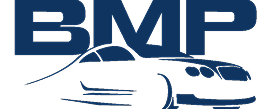

  

<h1 align="center">BMP Car Rental Web Application</h1>

  A final project requirement for the IT9A Laravel course, built with Laravel 12, Breeze, Blade, and Tailwind CSS.

## About BMP Car Rental

BMP Car Rental is a web application designed to allow users to browse, book, and manage car rentals. This project was developed as the final requirement for the IT9A Laravel course, demonstrating the ability to build a functional web application using the Laravel framework and related technologies.

Key features implemented in this application include:

- **User Authentication:** Secure user registration and login powered by Laravel Breeze.
- **Car Listings:** Display of available cars with relevant details (e.g., make, model, price, availability).
- **Booking System:** Functionality for users to select rental dates and book cars.
- **Contact Page:** A contact form or information for users to get in touch.
- **Role-Based Access Control:** Implementation of different user roles (e.g., customer, employee) with specific access permissions.
- **Modern User Interface:** A responsive and user-friendly design built with Tailwind CSS and Blade templates.

## Technologies Used

This project utilizes the following key technologies:

- **[Laravel 12](https://laravel.com/)**: The robust PHP web application framework.
- **[Laravel Breeze](https://laravel.com/docs/12.x/starter-kits#laravel-breeze)**: Minimal authentication scaffolding providing login, registration, email verification, and password reset features.
- **[Blade Templating Engine](https://laravel.com/docs/12.x/blade)**: Laravel's simple yet powerful templating engine for creating dynamic views.
- **[Tailwind CSS](https://tailwindcss.com/)**: A utility-first CSS framework for rapid UI development.

## Learning Resources

During the development of this project, the following resources were invaluable:

- **[Laravel Documentation](https://laravel.com/docs/12.x)**: The official and comprehensive Laravel documentation.
- **[Laravel Bootcamp](https://bootcamp.laravel.com)**: A guided tutorial for building a modern Laravel application.
- **[Laracasts](https://laracasts.com)**: A vast library of video tutorials on Laravel, PHP, and related technologies.

## Contributing

As this is a final project for a course, external contributions are not the primary focus at this time. However, feedback and suggestions are welcome. If you have any ideas or notice any issues, feel free to open an issue on this repository.

## Code of Conduct

Standard coding practices and respectful communication are expected within this project.

## Security Vulnerabilities

For any security vulnerabilities discovered within this project, please contact [jhiannejoseberida@gmail.com](mailto:jhiannejoseberida@gmail.com). We will address them promptly.

## License

This project is open-sourced software licensed under the [MIT license](https://opensource.org/licenses/MIT).